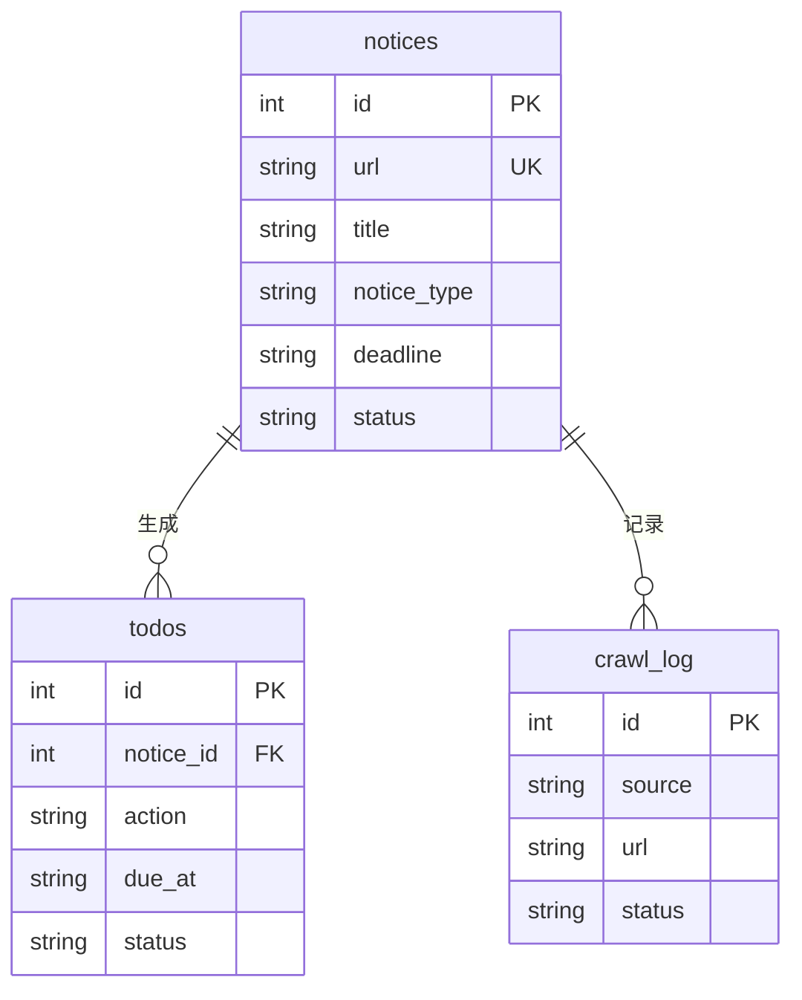

# 数据模型设计

## 1. SQLite 表结构

### 1.1 notices（通知表）

```sql
CREATE TABLE notices (
    id INTEGER PRIMARY KEY AUTOINCREMENT,
    url TEXT UNIQUE NOT NULL,           -- 通知详情页 URL（去重依据）
    source TEXT NOT NULL,               -- 来源：scuec/cxcy
    title TEXT NOT NULL,                -- 原始标题
    raw_content TEXT,                   -- 原始正文
    published_at TEXT,                  -- 发布时间（ISO 8601）
    crawled_at TEXT NOT NULL,           -- 抓取时间
    status TEXT DEFAULT 'raw',          -- raw/extracted/failed
    -- 结构化提取结果（提取后填充）
    notice_type TEXT,                   -- competition/lecture/...
    deadline TEXT,                      -- 截止时间（ISO 8601）
    location TEXT,                      -- 地点
    target_audience TEXT,               -- 面向对象
    registration_url TEXT,              -- 报名链接
    summary TEXT,                       -- 摘要
    extracted_at TEXT                   -- 提取时间
);

CREATE INDEX idx_notices_status ON notices(status);
CREATE INDEX idx_notices_deadline ON notices(deadline);
CREATE INDEX idx_notices_type ON notices(notice_type);
```

### 1.2 todos（待办表）

```sql
CREATE TABLE todos (
    id INTEGER PRIMARY KEY AUTOINCREMENT,
    notice_id INTEGER NOT NULL,          -- 关联通知
    action TEXT NOT NULL,                -- 待办内容，如"提交数学建模报名表"
    due_at TEXT,                         -- 截止时间
    status TEXT DEFAULT 'pending',       -- pending/done/skipped
    created_at TEXT NOT NULL,
    completed_at TEXT,
    FOREIGN KEY (notice_id) REFERENCES notices(id)
);

CREATE INDEX idx_todos_status ON todos(status);
CREATE INDEX idx_todos_due ON todos(due_at);
```

### 1.3 crawl_log（抓取日志）

```sql
CREATE TABLE crawl_log (
    id INTEGER PRIMARY KEY AUTOINCREMENT,
    source TEXT NOT NULL,
    url TEXT,
    status TEXT NOT NULL,               -- success/failed
    error TEXT,
    crawled_at TEXT NOT NULL
);
```

## 2. Pydantic 模型

### 2.1 通知提取结果

```python
from pydantic import BaseModel

class NoticeExtraction(BaseModel):
    """LLM 结构化提取的输出"""
    title: str
    notice_type: str  # competition/lecture/registration/scholarship/administrative/recruitment/other
    deadline: str | None  # ISO 8601，无则 None
    location: str | None
    target_audience: str | None
    registration_url: str | None
    summary: str
    key_dates: list[str]  # 其他重要日期
```

### 2.2 待办项

```python
class TodoItem(BaseModel):
    """单条待办"""
    action: str           # 待办内容
    due_at: str | None    # 截止时间
    priority: str = "normal"  # high/normal/low

class TodoList(BaseModel):
    """待办清单"""
    items: list[TodoItem]
```

### 2.3 通知卡片（前端展示）

```python
class NoticeCard(BaseModel):
    """前端展示用"""
    id: int
    title: str
    notice_type: str
    deadline: str | None
    location: str | None
    target_audience: str | None
    registration_url: str | None
    summary: str
    published_at: str | None
    source: str
    url: str
```

## 3. 向量库结构（Chroma）

```python
collection = chroma_client.create_collection(
    name="notices",
    metadata={"hnsw:space": "cosine"}
)

# 每条文档：
{
    "id": "notice_{notice_id}_chunk_{chunk_idx}",
    "embedding": [...],  # 384 维
    "document": "通知正文片段",
    "metadata": {
        "notice_id": 123,
        "title": "通知标题",
        "notice_type": "competition",
        "source": "scuec/cxcy"
    }
}
```

## 4. ER 关系


